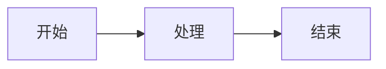

# Markdown 转微信公众号 HTML 转换器使用说明

## 功能特性

- ✅ 支持 Markdown Front Matter（YAML 格式）解析
  - 详细格式说明请参考 [MARKDOWN_FORMAT.md](MARKDOWN_FORMAT.md)
- ✅ 代码块缩进准确识别（使用 `<br>` + `&nbsp;` 方法）
- ✅ 代码块左侧显示行号（灰色、右对齐、不可选择）
- ✅ 图片自动转换为 base64 嵌入（支持本地路径和网络URL）
- ✅ 数学公式和 Mermaid 图表使用浅色背景强调（确保对比度和可读性）
- ✅ 多种主题风格（学术灰、节日、科技、公告）
- ✅ 可扩展的风格配置系统
- ✅ 支持列表（有序/无序，支持嵌套）
- ✅ 支持表格（支持对齐方式：左、中、右）
- ✅ 支持链接（支持带标题的链接）
- ✅ 支持水平分割线（`---`, `***`, `___`）
- ✅ 微信公众号兼容的 HTML 标签（仅使用白名单标签）

## 安装依赖

```bash
# 基本依赖（图片处理）
pip install requests

# 公式渲染（推荐）
pip install sympy matplotlib

# 如果不想安装 sympy 或 matplotlib，工具会自动使用 CodeCogs 在线服务作为备选
```

## 使用方法

### 基本用法

```bash
python3 md2wechat.py <输入文件.md> [-o <输出文件.html>] [-s <风格名称>]
```

### 示例

```bash
# 转换 Markdown 文件，使用默认风格和输出文件名
python3 md2wechat.py 2020-05-22-blog-post-13.md

# 指定输出文件
python3 md2wechat.py 2020-05-22-blog-post-13.md -o output.html

# 使用指定风格
python3 md2wechat.py 2020-05-22-blog-post-13.md -s academic_gray  # 学术灰风格（默认）
python3 md2wechat.py 2020-05-22-blog-post-13.md -s festival      # 节日快乐色彩系
python3 md2wechat.py 2020-05-22-blog-post-13.md -s tech          # 科技产品介绍色彩系
python3 md2wechat.py 2020-05-22-blog-post-13.md -s announcement # 重大事情告知色彩系
```

## 支持的 Markdown 语法

### Front Matter

```yaml
---
title: "文章标题"
date: 2020-05-22
tags:
   - 标签1
   - 标签2
---
```

### 标题

```markdown
# 一级标题
## 二级标题
### 三级标题
```

### 代码块

支持带语言标识的代码块：

````markdown
```c
double f(double a){
    static double a0=5;
    return a>a0?k1*(a-a0):k2*(a-a0);
}
```
````

**代码块特性**：
- ✅ 代码块的缩进会被准确识别并保留（使用 `<br>` + `&nbsp;` 方法）
- ✅ 自动在左侧显示行号（灰色、右对齐、不可选择）
- ✅ 行号宽度自动适应代码行数（1-9行：2em，10-99行：2.6em，以此类推）
- ✅ 支持语法高亮（基于 Pygments，支持多种编程语言）
- ✅ 长代码自动横向滚动（`overflow-x:auto`）

### 图片

支持本地路径和网络URL：

```markdown


```

图片会自动转换为 base64 格式嵌入到 HTML 中。

### 数学公式

支持行内公式和块级公式，**本地渲染为图片并转为 base64 嵌入**：

**行内公式**：使用单个 `$` 包裹

```markdown
这是行内公式：$E=mc^2$ 和 $x = \frac{-b \pm \sqrt{b^2-4ac}}{2a}$
```

**块级公式**：使用双 `$$` 包裹（居中显示）

```markdown
$$
\frac{\partial f(x)}{\partial v_i}=\sum_{j=1}^n \frac{\partial f(x)}{\partial u_j} \frac{\partial u_j}{\partial v_i}
$$
```

**渲染方式**：
- **优先使用 CodeCogs**：使用 CodeCogs 在线服务渲染公式，下载图片并转为 base64 嵌入。CodeCogs 支持复杂的 LaTeX 公式，渲染质量好
- **备选方案**：如果 CodeCogs 失败（如网络问题或某些复杂公式不支持），会自动回退到 sympy + matplotlib 或 matplotlib
- **图片嵌入**：所有公式图片都以 base64 形式嵌入 HTML，无需外部依赖，在微信公众号中显示稳定
- **自动清理**：转换完成后会自动删除临时渲染的图片文件
- **背景强调**：
  - 公式图片使用透明背景渲染，在 HTML 层面添加浅色背景容器来强调
  - 行内公式（`$...$`）不使用背景强调，保持简洁，与文本自然融合
  - 块级公式（`$$...$$`）使用米黄色背景（#FFF8DC）强调，居中显示，添加内边距和圆角
  - 确保块级公式在任何主题背景下都有良好的对比度和可读性
- **行内公式优化**：
  - 使用 `display:inline-block` 和 `vertical-align:middle` 确保与文本正确对齐
  - 使用 `width:auto` 和 `height:auto` 让宽度自适应渲染内容
  - 使用 `max-height:1.2em` 限制最大高度，避免过大

**优点**：
- ✅ 显示稳定，支持移动端
- ✅ 保留字体与排版
- ✅ 不会被微信清洗
- ✅ 图片以 base64 嵌入，无需外部依赖

### Mermaid 图表

支持 Mermaid 图表语法，自动转换为 PNG 图片并嵌入 HTML：

````markdown

````

**渲染方式**：
- **使用 mmdc 转换**：使用 `@mermaid-js/mermaid-cli` 工具将 Mermaid 代码转换为 PNG 图片
- **图片嵌入**：所有图表图片都以 base64 形式嵌入 HTML，无需外部依赖
- **自动清理**：转换完成后会自动删除临时文件
- **背景强调**：
  - Mermaid 图表使用透明背景渲染，在 HTML 层面添加极浅绿色背景容器来强调
  - 使用极浅绿色背景（#F0FFF0）强调图表，添加内边距和圆角
  - 确保图表在任何主题背景下都有良好的对比度和可读性
- **宽高比控制**：对于横向布局的总结图（`graph LR` 且包含 `style` 配置），自动设置 2.35:1 的宽高比

**安装要求**：
- 需要安装 `@mermaid-js/mermaid-cli`：`npm install -g @mermaid-js/mermaid-cli`
- 详细安装说明请参考 [INSTALL.md](../INSTALL.md)

**优点**：
- ✅ 显示稳定，支持移动端
- ✅ 支持多种图表类型（流程图、时序图、甘特图等）
- ✅ 图片以 base64 嵌入，无需外部依赖
- ✅ 自动适配主题，确保在任何背景下都清晰可见

### 列表

支持有序列表和无序列表，并支持嵌套：

**无序列表**：使用 `-`、`*` 或 `+` 开头

```markdown
- 第一项
- 第二项
  - 嵌套项1
  - 嵌套项2
- 第三项
```

**有序列表**：使用数字和点开头

```markdown
1. 第一步
2. 第二步
   1. 子步骤1
   2. 子步骤2
3. 第三步
```

列表会自动转换为 HTML 的 `<ul>` 或 `<ol>` 标签，嵌套列表也会正确显示。

### 表格

支持 Markdown 表格语法，包括对齐方式：

```markdown
| 列1 | 列2 | 列3 |
|:---|:---:|---:|
| 左对齐 | 居中 | 右对齐 |
| 数据1 | 数据2 | 数据3 |
```

对齐方式说明：
- `:---` 或 `:---:` - 左对齐
- `:---:` - 居中对齐
- `---:` - 右对齐

**注意**：由于微信公众号不支持 `<table>` 标签，表格使用 `<span>` 和 `<p>` 标签配合内联样式模拟，确保在微信中正常显示。

### 链接

支持标准 Markdown 链接语法：

**基本链接**：
```markdown
[链接文本](https://www.example.com)
```

**带标题的链接**：
```markdown
[链接文本](https://www.example.com "链接标题")
```

链接会自动转换为 HTML 的 `<a>` 标签，并添加微信兼容的样式（蓝色、下划线）。

**注意**：
- 链接可以在段落、列表、表格等任何地方使用
- 链接文本可以包含其他内联格式（粗体、斜体等）
- URL 中的特殊字符会自动转义

### 文字颜色和加粗

MD2WeChat 支持文字颜色设置，可以与加粗组合使用。

#### 基础颜色

使用方括号语法设置文字颜色：

```markdown
[这是红色文字]{color:#ff0000}
[这是蓝色文字]{color:blue}
[这是绿色文字]{color:green}
```

#### 加粗+颜色组合

在加粗文本后添加颜色设置：

```markdown
**这是加粗红色文字**{color:#ff0000}
**这是加粗蓝色文字**{color:blue}
```

#### 标签风格颜色

使用标签风格设置颜色：

```markdown
{color:#ff0000}这是红色文字{/color}
{color:blue}这是蓝色文字{/color}
```

#### 支持的颜色格式

- **十六进制**：`#ff0000`、`#f00`（短格式）
- **RGB**：`rgb(255,0,0)`
- **RGBA**：`rgba(255,0,0,0.5)`（支持透明度）
- **颜色名称**：`red`、`blue`、`green`、`orange`、`purple` 等常见颜色名称

**示例**：

```markdown
- **重要提示**{color:#ff0000}：这是红色加粗文字
- [注意]{color:orange}：这是橙色文字
- {color:rgb(0,128,255)}这是 RGB 蓝色{/color}
```

**注意**：
- 颜色值必须是有效的 CSS 颜色格式
- 支持的颜色名称有限，建议使用十六进制或 RGB 格式
- 颜色和加粗可以在列表、段落等任何地方使用

### 其他语法

- **粗体**：`**粗体文本**` 或 `__粗体文本__`
- *斜体*：`*斜体文本*` 或 `_斜体文本_`
- `行内代码`：使用反引号包裹

## 风格配置

当前支持以下风格：

- `academic_gray`（默认）：学术灰风格，适合技术/科研文章
- `festival`：节日快乐色彩系，适合节日祝福和庆祝内容
- `tech`：科技产品介绍色彩系，适合产品介绍和科技文章
- `announcement`：重大事情告知色彩系，适合重要通知和公告

### 添加新风格

在 `src/md2wechat.py` 中的 `STYLES` 字典中添加新的 `StyleConfig`：

```python
STYLES = {
    "academic_gray": StyleConfig(...),
    "festival": StyleConfig(...),
    "tech": StyleConfig(...),
    "announcement": StyleConfig(...),
    "your_style": StyleConfig(
        name="你的风格名称",
        header_bg_color="#...",
        card_bg_color="#...",
        # ... 其他配置
    ),
}
```

## 输出格式

生成的 HTML 文件可以直接：
1. 在浏览器中打开查看效果
2. 全选复制到微信公众号编辑器正文区
3. 粘贴后即可在公众号中正常显示

## 注意事项

1. **图片路径**：相对路径基于 Markdown 文件所在目录解析
2. **代码块缩进**：使用空格或制表符都可以，工具会自动识别并保留相对缩进
3. **代码块横向滚动**：长代码支持横向滚动（`overflow-x:auto`），如果微信不支持会自动换行
4. **数学公式**：本地渲染为图片并转为 base64 嵌入，支持行内公式（`$...$`）和块级公式（`$$...$$`）
5. **微信兼容性**：仅使用微信白名单 HTML 标签，确保不会被编辑器过滤

## 技术细节

### 代码块缩进处理

- 计算所有非空行的最小前导空格数
- 每行相对最小缩进的空格数转换为 2 倍数量的 `&nbsp;`
- 使用 `<br>` 实现换行

### 图片处理

- 本地图片：读取文件并转换为 base64
- 网络图片：下载并转换为 base64
- 自动识别图片 MIME 类型

### 水平分割线

支持 Markdown 标准水平分割线语法，使用 `---`、`***` 或 `___`（至少3个字符）：

```markdown
这是一段文字。

---

这是分割线后的内容。

***

也可以使用星号。

___

或者使用下划线。
```

**说明**：
- 支持三种格式：`---`（连字符）、`***`（星号）、`___`（下划线）
- 至少需要3个相同字符，前后可以有空格
- 会自动转换为 HTML `<hr>` 标签，使用主题边框颜色
- 分割线前后会自动添加适当的间距

### HTML 标签限制

根据微信公众平台限制，仅使用以下标签：
- `<p>`, `<span>`, ``, `<br>`, `<div>`
- `<strong>`, `<em>`
- `<ul>`, `<ol>`, `<li>`（列表）
- `<a>`（链接）
- `<hr>`（水平分割线）
- 内联样式（`style` 属性）

## 常见问题

### Q: 图片无法显示？
A: 检查图片路径是否正确，确保图片文件存在或网络URL可访问。

### Q: 代码块缩进不正确？
A: 确保代码块使用空格或制表符进行缩进，不要混用。

### Q: 转换后的 HTML 在微信中显示异常？
A: 检查是否使用了微信不支持的标签，工具已自动过滤，但某些复杂样式可能被微信忽略。

## 许可证

MIT License

