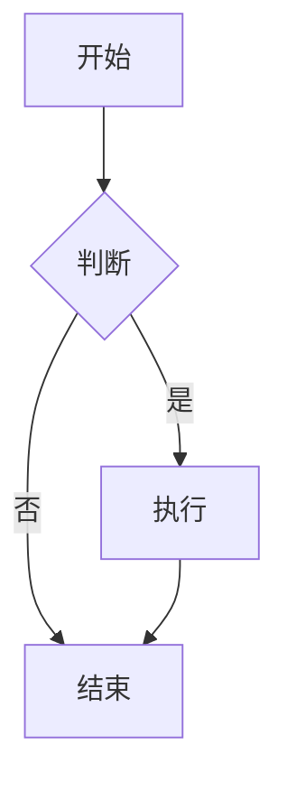
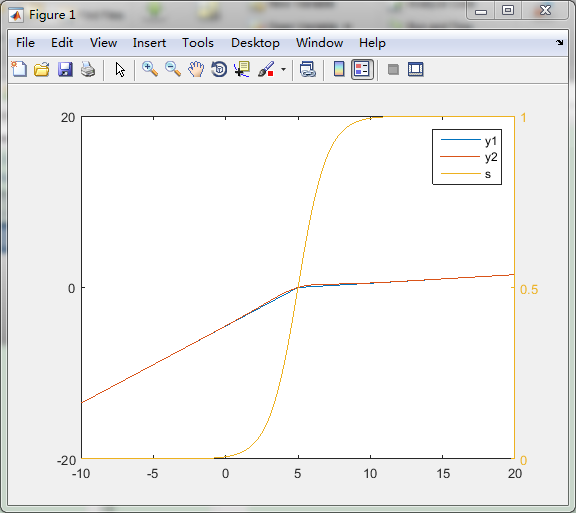
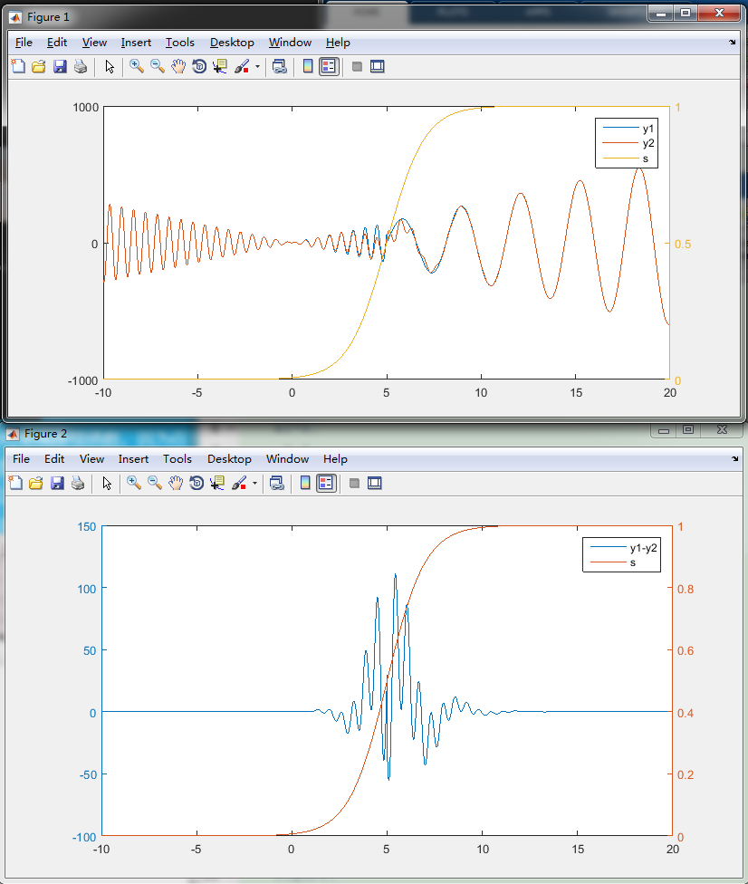

在理科及工科中，总会遇到数值计算。面对观测方程，进行数据拟合，线性化，或者积分，或者非线性优化与梯度下降算法获得最优解极为常见的问题。这些过程，我们需要
自动微分。它在非线性优化，扩展卡曼滤波，变分同化，及机器学习中有极大的用途。

## 微分方法



### 通过解析式求导计算

这是最常用，也是最准确的;但是涉及到手动计算，比较复杂与繁重。
比如简单的：
$$sin'(x)|_{x=\theta}=cos(x)|_{x=\theta}.$$
$$cos'(x)|_{x=\theta}=-sin(x)|_{x=\theta}.$$
但是在建立数学模型时，由于有多个参数以及用户自定义形式的拟合函数，在实现过程中如果手动计算各个参数的导数，比如球谐函数导数，将是极大地工作量。

一般的我们可以通过初等函数定义的导数及链式求导可以表示出已知表达式的所有函数对于某个参数的导数:

$$
\frac{\partial  f(x)}{\partial v_i}=\sum_{j=1}^n \frac{\partial  f(x)}{\partial u_j} \frac{\partial  u_j}{\partial v_i}
$$

### 通过差分计算

$$
\frac{\partial f(x)}{\partial x} \xrightarrow{front}\frac{f(x+\delta h)-f(x)}{\delta h}\\
\frac{\partial f(x)}{\partial x} \xrightarrow{back}\frac{f(x)-f(x-\delta h)}{\delta h}\\
\frac{\partial f(x)}{\partial x} \xrightarrow{mid}\frac{f(x+\frac{\delta h}{2})-f(x-\frac{\delta h}{2})}{\delta h}
$$

差分方法的问题在于步长$\delta h$的选择极为不易：$\delta h$过大将导致精度不够；$\delta h$过小将导致截断误差产生偏差。

### 通过链式自动求解计算

链式自动求解计算可以在计算函数值的时候将其对应的不同参数的导数也可以计算出来，这样避免了使用差分方式计算一个函数对应不同变量的导数。
但是我们极容易想到，这种边计算函数表达式，边求导可以满足足够的精度，同时避免了选取微分步长$\deltaｈ$的选择。但是在表达与计算模型过程中依然存在`P&NP`问题。在生活中，我们可以通过连续精确表示来表达可求解问题，比如简单的动力学问题，Ｎ体问题的单体相对论受力情况（通过后牛顿及ＰN2.5p之类的多次近似），或者随着级数增大而收敛的级数解。但是还有一类问题，判断一个解是否存在，判断一个表达是否收敛的，判断一个循环满足要求时循环了多少次？前一类问题，我们总可以用初等函数组合表示出的解或者方程表达出来，进而根据链式求导将参数与初等函数组合的导数表示出来。后一种，由于是否存在，是否收敛，及循环次数却是极不容易的。

我们对于NP问题不能完全解决，但是对于费连续性函数的求导问题需要解决，因为它不仅涉及到了数值上的连续性问题，而且导致了导数上的无穷大，进而影响到梯度矩阵计算，使得梯度下降或者误差反向传播受阻。

但是在现实生活中，通过判断条件形成了条件函数和分段函数，甚至$\delta(x-x_0)$函数，导致函数形式的不连续。在机器学习中，通过

$$
reLU(x,k,a)=\begin{cases}0,x\lt a,\\k(x-a),x \ge a\end{cases}
$$

解决了连续性问题，但是在误差传播过程中，由于在$a$处导数不连续，也影响到了梯度变化的连续性。为此我们寻找到了$Sigmoid(x,a,u)$来弥合这里的误差:

$$
S(x,a,u)=\frac{1}{1+exp(-\frac{x-a}{u})}
$$

上式中，$x$变量受到$s$条件影响，通过$u$参数调节选择函数的变化过程。如下图，$S(x,s,u)$的变化在$0$处的分布：

")

易知，如果调节$u$，可以使得$S(x,a,u)$函数在条件处变为直接转点。当然对于分段函数我们可以通过类似的形式组合出一般形式:

$$
y(x,a_i)=\sum_{i=1}^n \pi_{j=1}^i (1-S(x,a_j,u))\pi_{j=i+1}^n S(x,a_j,u) y_i(x).
$$

以线性选择函数为例，我们用matlab做了测试：
```c
double f(double a){
    static double a0=5;
    static double k1=0.3;
    static double k2=0.6;
    return a>a0?k1*(a-a0):k2*(a-a0);
}
```

以下用matlab测试了Sigmoid的函数$S(x,a,u)$作用在两个线性函数上的效果：
```matlab
clear;
close all;
clc;
u=0.5;
a0=5;
a1=4;
a2=7;
w1=2;
w2=10;
k1=30;
k2=9;
x=-10:0.01:20;
y1=zeros(1,length(x));
p1=k1.*(x-a0);
p2=k2.*(x-a0);
y1(x>a0)=p1(x>a0);
y1(x<=a0)=p2(x<=a0);
s=1./(1+exp(-u.*(x-a0)));
y2=s.*p1+(1-s).*p2;
figure;
plotyy(x,[y1;y2],x,s);
legend('y1','y2','s');
figure;
plotyy(x,[y1-y2],x,s);
legend('y1-y2','s');
```



当$p1,p2$为差异极大的非线性函数时,即如下表示

```matlab
p1=k1.*(35-x).*sin(w1.*(x-a1));
p2=k2.*x.*cos(w2.*(x-a2));
```
则结果与误差分布如下。



从图上可以看到，Sigmoid函数可以较好的表达出两个非线性函数的渐变过程，但是在衔接部分也会出现极大的误差。

## 链式自动求解计算的一个C++模板实现
附录实现的自动微分函数如下：
```c
//
//  autodiff_tnna.h
//  TNNA
//
//  Created by Mapoet Niphy on 2018/11/2.
//  Copyright © 2018年 Mapoet Niphy. All rights reserved.
//

#ifndef autodiff_tnna_h
#define autodiff_tnna_h
#include <valarray>
#include "tensor_tnna.h"
namespace TNNA{
    template<class Cell>
    struct autodiff{
        Cell   _val;
        std::valarray<Cell>   _dval;
        autodiff(const Cell& val = Cell(), std::valarray<Cell> dval = std::valarray<Cell>()) :_val(val), _dval(dval){}
        autodiff<Cell> operator=(const Cell& v){
            return autodiff<Cell>(v);
        }
        operator Cell()const{
            return _val;
        }
        autodiff<Cell> operator +=(const autodiff<Cell>& a){
            _val =_val+ a._val;
            _dval =_dval+ a._dval;
            return *this;
        }
        autodiff<Cell> operator -=(const autodiff<Cell>& a){
			_val = _val- a._val;
			_dval = _dval- a._dval;
            return *this;
        }
        autodiff<Cell> operator *=(const autodiff<Cell>& a){
            auto  val = _val;
            auto dval = _dval;
            _val = val*a._val;
            _dval = dval*a._val + val*a._dval;
            return *this;
        }
        autodiff<Cell> operator /=(const autodiff<Cell>& a){
            auto  val = _val;
            auto dval = _dval;
            _val = val / a._val;
            _dval = (dval*a._val - val*a._dval) / (a._val*a._val);
            return *this;
        }
    };
    template<class Cell>
    autodiff<Cell> operator+(const autodiff<Cell>& a, const autodiff<Cell>& b){
        autodiff<Cell> v = a;
        v += b;
        return v;
    }
    template<class Cell>
    autodiff<Cell> operator-(const autodiff<Cell>& a, const autodiff<Cell>& b){
        autodiff<Cell> v = a;
        v -= b;
        return v;
    }
    template<class Cell>
    autodiff<Cell> operator*(const autodiff<Cell>& a, const autodiff<Cell>& b){
        autodiff<Cell> v = a;
        v *= b;
        return v;
    }
    template<class Cell>
    autodiff<Cell> operator/(const autodiff<Cell>& a, const autodiff<Cell>& b){
        autodiff<Cell> v = a;
        v /= b;
        return v;
    }
    template<class Cell>
    autodiff<Cell> operator+(Cell a, const autodiff<Cell>& b){
        autodiff<Cell> v =b;
        v += a;
        return v;
    }
    template<class Cell>
    autodiff<Cell> operator-(Cell a, const autodiff<Cell>& b){
        autodiff<Cell> v;
        v._val = a - b._val;
        v._dval = -b._dval;
        return v;
    }
    template<class Cell>
    autodiff<Cell> operator*(const Cell& a, const autodiff<Cell>& b){
        autodiff<Cell> v;
        v._val = a * b._val;
        v._dval = a*b._dval;
        return v;
    }
    template<class Cell>
    autodiff<Cell> operator/(const Cell& a, const autodiff<Cell>& b){
        autodiff<Cell> v;
        v._val = a / b._val;
        v._dval = -a*b._dval / (b._val*b._val);
        return v;
    }
    template<class Cell>
    autodiff<Cell> operator+(const autodiff<Cell>& a, const Cell& b){
        autodiff<Cell> v = a;
		v._val = v._val+ b;
        return v;
    }
    template<class Cell>
    autodiff<Cell> operator-(const autodiff<Cell>& a, const Cell& b){
        autodiff<Cell> v = a;
		v._val = v._val- b;
        return v;
    }
    template<class Cell>
    autodiff<Cell> operator*(const autodiff<Cell>& a, const Cell& b){
        autodiff<Cell> v = a;
		v._val = v._val* b;
		v._dval = v._dval* b;
        return v;
    }
    template<class Cell>
    autodiff<Cell> operator/(const autodiff<Cell>& a, const Cell& b){
        autodiff<Cell> v = a;
		v._val = v._val/ b;
		v._dval = v._dval/ b;
        return v;
	}
	template<class Cell>
	autodiff<Cell> pow(const autodiff<Cell>& a, const autodiff<Cell>& b){
		autodiff<Cell> v;
		v._val = std::pow(a._val, b._val);
		v._dval = b._val*std::pow(a._val, b._val - 1)*a._dval + v._val*std::log(a._val)*b._dval;
		return v;
	}
	template<class Cell>
	autodiff<Cell> pow(const Cell& a, const autodiff<Cell>& b){
		autodiff<Cell> v;
		v._val = std::pow(a, b._val);
		v._dval = v._val*std::log(a)*b._dval;
		return v;
	}
	template<class Cell>
	autodiff<Cell> pow(const autodiff<Cell>& a, const Cell& b){
		autodiff<Cell> v;
		v._val = std::pow(a._val, b);
		v._dval = b*std::pow(a._val, b - 1)*a._dval;
		return v;
	}
	template<class Cell>
	autodiff<Cell>& abs(const autodiff<Cell>& a){
		autodiff<Cell> v;
		v._val = std::abs(a._val);
		v._dval = (a._val > 0 ? 1.0 : -1.0)*a._dval;
		return v;
	}
    template<class Cell>
    autodiff<Cell> sin(const autodiff<Cell>& a){
        autodiff<Cell> v;
        v._val = sin(a._val);
        v._dval = cos(a._val)*a._dval;
        return v;
    }
    template<class Cell>
    autodiff<Cell> cos(const autodiff<Cell>& a){
        autodiff<Cell> v;
        v._val = cos(a._val);
        v._dval = -sin(a._val)*a._dval;
        return v;
    }
    template<class Cell>
    autodiff<Cell> tan(const autodiff<Cell>& a){
        autodiff<Cell> v = sin(a) / cos(a);
        return v;
	}
	template<class Cell>
	autodiff<Cell> exp(const autodiff<Cell>& a){
		autodiff<Cell> v;
		v._val = std::exp(a._val);
		v._dval = std::exp(a._val)*a._dval;
		return v;
	}
	template<class Cell>
	autodiff<Cell> asin(const autodiff<Cell>& a){
		autodiff<Cell> v;
		v._val = asin(a._val);
		v._dval = 1.0/sqrt((1.0-a._val*a._val))*a._dval;
		return v;
	}
	template<class Cell>
	autodiff<Cell> acos(const autodiff<Cell>& a){
		autodiff<Cell> v;
		v._val = acos(a._val);
		v._dval = -1.0/sqrt((1.0-a._val*a._val))*a._dval;
		return v;
	}
	template<class Cell>
	autodiff<Cell> atan(const autodiff<Cell>& a){
        autodiff<Cell> v;
        v._val = atan(a._val);
        v._dval = -1.0/(a._val*a._val+1.0)*a._dval;
		return v;
	}
	template<class Cell>
	autodiff<Cell> log(const autodiff<Cell>& a){
		autodiff<Cell> v;
		v._val = std::log(a._val);
		v._dval = a._dval / (a._val);
		return v;
	}
}
#endif /* autodiff_h */
```
