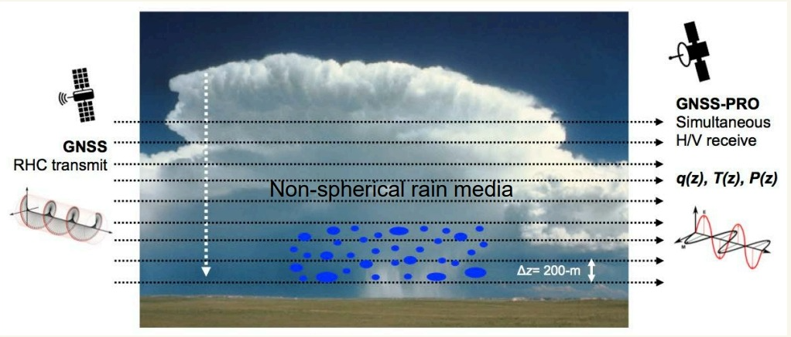

这是一篇用于验证微信公众号草稿箱 API 的短文示例。

它的目标很简单：

1. 验证 Markdown 可以正常转换为公众号兼容 HTML。
2. 验证正文图片会被自动上传到微信图床。
3. 验证封面图可以成功上传并生成 `thumb_media_id`。
4. 验证最终图文可以成功进入公众号草稿箱。

下面放一张简单的示意图：

如果你能在公众号后台看到这篇文章，说明整条链路已经打通。
